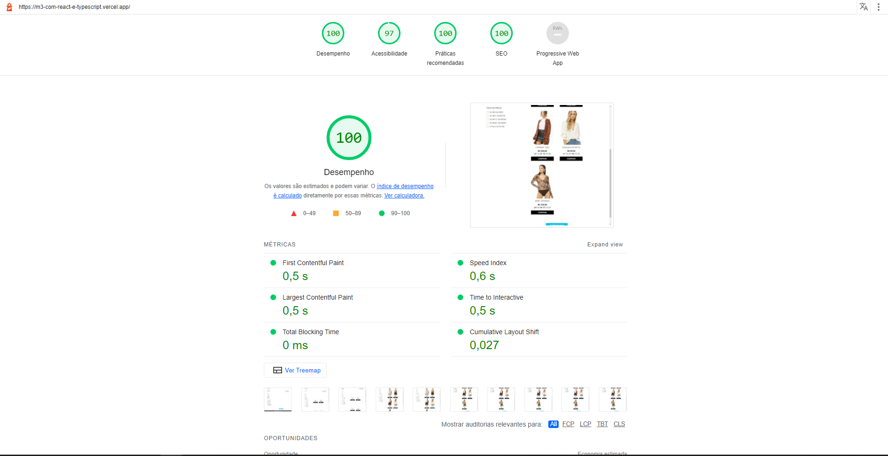

<h1 align="center" class="line-1 anim-typewriter">Desafio M3 </h1>


<h2>Preview</h2>


<br>

<h2>Acessibilidade</h2>



<div align="center"  class="links">
    <a href="#the_challenge">O desafio</a> |
     <a href="#links">Links</a> |
      <a href="#built_with">Ferramentas usadas</a> |
       <a href="#author">Coisa para se fazer</a>  |
       <a href="#resources">Recursos</a>
</div>

<h2 id="the_challenge"> 🌋 O desafio</h2>

Esta é a solução do desafio proposto pela [Agência Digital M3](https://m3ecommerce.com/).

O objetivo deste desafio foi para avaliar os conhecimentos fundamentais de front-end, por isto foi pedido que não fosse usado nenhum framework, ou se fosse usar algo, que usasse ReactJS.

- [x] HTML5 e CSS3;
- [x] Requisição a API para obter os produtos;
- [x] Funcionalidade: filtrar produtos por cor, tamanho e preço;
- [x] Funcionalidade: adicionar produto ao carrinho;
- [x] Funcionalidade: carregar mais produtos;
- [x] Não utilizar Bootstrap, Foundation CSS, Semantic UI ou semelhantes;
- [x] Responsividade.

<h2 id="Observações">🔎 Observações</h2>

- Como foi deixado bem explícito que este desafio era para os validar os conhecimentos fundamentais, porém, eu vi que a M3 usa ferramentas como o ReactJS e TypeScript. Então decidi fazer duas versões deste mesmo projeto, uma usando __HTML, CSS e JavaScript__ e outra versão usando __ReactJS, TypeScript e CSSinJS__.
- No relatório de acessibilidade do **lighthouse** ficou mostrando que ocorreu um erro de acessibilidade com o botão de "Mostrar mais itens", devido as suas cores, porém, como tentei deixar o mais próximo possivel do **Figma** deixei este pequeno detalhe.
- Em vez de colocar as imagens otimizadas localmente nos arquivos do projeto, otimizei as mesmas para **.webp** (-95% do tamanho) e as coloquei em um serviço de hospedagem de imagens.

<h2 id="links">🔗 Links</h2>

- Site online:  [https://m3-com-react-e-typescript.vercel.app/](https://m3-com-react-e-typescript.vercel.app/)
- Versão do projeto feita com **HTML**, **CSS** e **JavaScript**: [https://github.com/MarlonPassos-git/Desenvolvedor-M3](https://github.com/MarlonPassos-git/Desenvolvedor-M3)
- Versão do projeto feita com **ReactJS**, **TypeScript** e **StyledComponents**: [https://github.com/MarlonPassos-git/m3-com-react-e-typescript](https://github.com/MarlonPassos-git/m3-com-react-e-typescript)

<h2 id="built_with">👷‍♂️ Ferramentas utilizadas</h2>

- Verção com React JS:
-   TypeScript;
-   Styled-Components;
-   ReactJS.


- Verção Vanilla:
-   HTML5;
-   CSS3;
-   JavaScript;
-   Gulp;


<h2 id="built_with">📝 Como rodar o projeto localmente?</h2>

- Verção com React JS:
```bash

  git clone https://github.com/MarlonPassos-git/m3-com-react-e-typescript

  cd m3-com-react-e-typescript

  npm install

  npm run start
```

- Verção Vanilla:
```bash

  git clone https://github.com/MarlonPassos-git/Desenvolvedor-M3

  cd Desenvolvedor-M3

  npm install

  npm run dev
```


<h2 id="funcionalidade">⚙ Funcionalidades</h2>

- [x] Criar o projeto sem usar nenhuma biblioteca de componentes pré-prontos;
- [x] Criar versão com HTML, CSS e JavaScript;
- [x] Pegar os dados da API e renderizar na tela;
- [x] Filtras os produtos por:
  - [x] Cor;
  - [x] Tamannho;
  - [x] Preço.
- [x] Reorganizar a ordem dos produtos:
  - [x] Mais recente;
  - [x] Maior preço;
  - [x] Menor preço.
- [x] Otimizar as imagens;
- [x] Adicionar produtos no carrinho quando clicar em comprar;
- [x] Formulário ficar sincronizado com a versão desktop e mobile;
- [x] O botão de mostrar mais itens soma quando não tem mais nada de produtos;
- [x] Efeito de hover em todos os elementos clicáveis;
- [x] Efeito de foco em todos os elementos usando o TAB;
- [x] Colocar o site no ar;
- [x] Colocar a API no ar.


<h2 id="author">👨‍🎓 Autor </h2>

- Nome: Marlon Felipe dos Passos
- E-mail: marlonfelipepassv2@gmail.com

<h2 id="resources">🚧 Problemas para corrigir</h2

- [x] Arrumar o controle por TABs da página (ordem e mostrar elementos selecionados);
- [ ] Tem que adicionar o restante dos textos com o Cypress;
- [ ] Adicionar um Lasy Load nos elementos do menu para evitar download de código desnecessário em resoluções específicas;
- [ ] Adicionar MEMO nos componentes para evitar renderização desnecessária;
- [ ] Adicionar uma mensagem para o usuário quando não tiver nenhum produto nos filtros que ele selecionou.

<h2 id="resources">📚 Recursos</h2>

- Para alguns elementos que eu queria um tamanho diferente em várias telas usei uma bibliote que estou desenvolvendo, denominada progressive-size, que tem origem neste [artigo](https://css-tricks.com/linearly-scale-font-size-with-css-clamp-based-on-the-viewport/#for-those-who-dont-mind-that-edge-case). Sendo assim, é por isto que em alguns elementos o tamanho não está em PX, mas em função CSS usando clamp, min, max e calc.
- Documentação do [ReactJS](https://reactjs.org/docs/getting-started.html).
